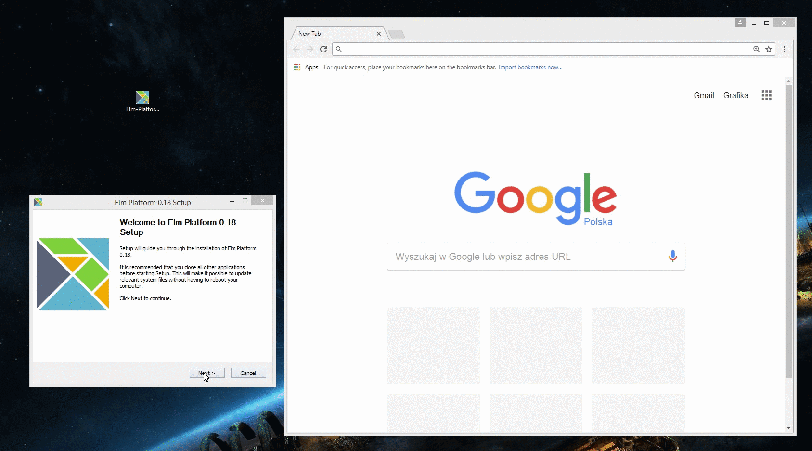

## How to get your environment ready for the workshop?

First, follow the instructions below in order to install Elm and set up your favourite text editor. I personally use VS Code with the Elm extension and it works just fine :)

https://guide.elm-lang.org/install.html

Once you're done, create a new folder on your local machine and run the following commands from it:

```
git clone https://github.com/Youenn-Bouglouan/hello-elm-workshop-wroclaw.git
elm-reactor --port 4567
```

Check your setup by opening the following URL in your browser:

```
http://localhost:4567/Hello.elm
```

The .gif below shows you just how fast it is:




Did it work? **Fantastic!**
If not, do not hesitate to drop me an email and I'll see what I can do to help.